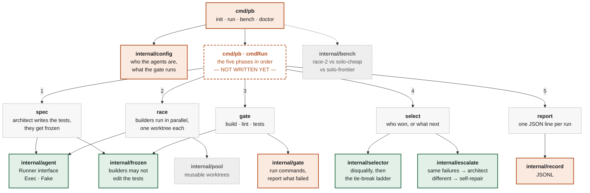

# parallel-builders

`pb` keeps you at the two ends of building a feature — describing it, and approving it — and takes you out of the middle, where the code gets written and reviewed.

In between, a strong model turns your description into a test suite, cheap models race to pass those tests in parallel, and the tests decide the winner. You describe the feature; you approve the result; you never read a losing diff.

> **One strong agent writes the tests. Cheap agents race to satisfy them. The tests pick the winner.**

```
pb run -brief rate-limit.toml

  spec     architect wrote 6 tests · frozen at a1b2c3d
  race     sonnet    worktree 0
           gpt-5.3   worktree 1
  gate     sonnet    build ✓  lint ✓  tests 5/6   FAIL  C5
           gpt-5.3   build ✓  lint ✓  tests 6/6   PASS
  winner   gpt-5.3 — only passing candidate
           2 files, +34 −6
```

## How it works

**One expensive call, at the front.** The architect reads the task and writes a test suite — and nothing else. That suite is committed and **frozen**: it is the definition of "correct" for this change, and it is read-only from that point on.

**Cheap models race.** Two builders get the same task, the same frozen tests, and their own git worktree. Neither sees the other's work. Using two different model families matters — the value of racing comes from *independent* errors.

**A compiler decides.** Build, lint, and the frozen tests. No model is consulted, so selection is deterministic, free, and repeatable. When more than one candidate passes, a ladder of computable tie-breakers picks the winner: smallest diff, then fewest files, then fewest new dependencies.

**Nobody reads the losing diff.** Including you.

## Two rules that make it work

**Builders may not edit the tests.** Enforced as a check on the diff, not as an instruction in a prompt. A builder told "make the tests pass" will, given the chance, weaken an assertion — and a green run looks identical either way.

**Tests must fail before the change exists.** New tests are run against the previous commit; any that *pass* are testing nothing and get rejected. This is free, needs no model, and catches a bad specification before you have paid two builders to satisfy it.

## When they all fail

Comparing the two sets of failing test names costs nothing and decides what happens next:

| | |
|---|---|
| **Failed the same test, the same way** | Two independent attempts got stuck in the same place — the *specification* is the likely problem. Escalate. |
| **Failed different tests** | Two ordinary mistakes. Each builder gets its own diff and its own failures and returns a patch. No expensive call. |

Repair is not regeneration. "Try again" costs what the first round cost; handing back the diff and the specific failure produces a small patch instead. Same model, same round, a fraction of the bill.

Capped at two rounds, then it comes to you.

## Architecture

Every box below is a Go package. Colour is status, not category.



🟩 implemented and tested  🟧 partial  ⬜ stub  ⬛ not written

### The honest read of that picture

**The leaves are real. The trunk is not.**

Every `internal/` package currently imports *nothing* from this repo — they are independent, pure, and unit-testable, which is why three of them are already finished and covered. But it also means **nothing calls anything yet**. `cmdRun` is where they get assembled, and it is a list of TODOs.

That ordering was deliberate. The subtle parts are the leaves — what disqualifies a candidate, how you tell a spec problem from a coding mistake, which glob counts as a test file. Those are pure functions, so they can be got right in isolation and proven with tests. The wiring is mechanical by comparison, but it can't be written until `pool` and `gate` are real, because it has nothing to hold.

**Read it in this order** if you want to understand the tool: `selector` → `escalate` → `frozen`. Roughly 400 lines, no dependencies, and between them they contain every decision the system makes.

## Status

`pb init` and `pb run` both work. The pipeline runs end to end — spec, race,
gate, select, repair — verified against scripted agents, so none of it has
spoken to a model yet.

**Requires macOS or Linux.** Slot locking and process-group cleanup use unix
semantics; on Windows use WSL.

| | |
|---|---|
| `internal/frozen` | ✅ the test-file guard |
| `internal/selector` | ✅ disqualifiers and the tie-break ladder |
| `internal/escalate` | ✅ the failure-set comparison |
| `internal/agent` | ✅ runner interface, exec and fake |
| `internal/brief` | ✅ the specification as data, stable criterion ids |
| `internal/pool` | ✅ one reusable worktree per builder |
| `internal/gate` | ✅ deterministic checks + `go test -json` parsing |
| `internal/run` | ✅ the five phases wired, including repair rounds |
| `internal/config`, `setup`, `record` | 🚧 partial |
| `internal/bench` | ⛔ stub |

## Building

```sh
go build ./cmd/pb
go test ./...
```

One dependency: `BurntSushi/toml`.

## Trying it

```sh
pb init                       # interactive setup, writes .pb.toml
pb doctor --live              # confirms your agents and model flags work
pb run -brief spec.toml       # spec, race, gate, select
```

## Security

`pb` runs coding agents automatically, in parallel, with no human watching each
one. That is the whole point, and it is also the risk: an agent asked to
implement a feature can run arbitrary commands, and a git worktree isolates
files between builders — it is **not** a security boundary. Nothing stops a
misbehaving or prompt-injected agent from reading `~/.ssh` or reaching the
network unless something outside the agent does.

So two things are load-bearing here, and neither is optional:

- **Untrusted text is sanitised before it reaches a model.** Your brief, and
  every example file it points at, is embedded into the prompt of every builder
  and every repair round. It is redacted for credentials and stripped of
  injection control tokens first, because otherwise a fixture containing
  instruction-shaped text becomes an instruction to an agent with write access.
- **Agents should run sandboxed, not with permissions bypassed.** Handing an
  agent `--dangerously-skip-permissions` because it cannot answer a prompt
  headlessly is the lazy answer and a real footgun. The intended model is a
  per-run sandbox (a container, or macOS seatbelt) that denies network and
  writes outside the worktree — so safety does not depend on the agent
  cooperating. Running without a sandbox is an explicit, warned opt-in, never a
  default.

If you find a security issue, please open an issue marked security rather than a
public PR with a proof of concept.

## Licence

MIT
