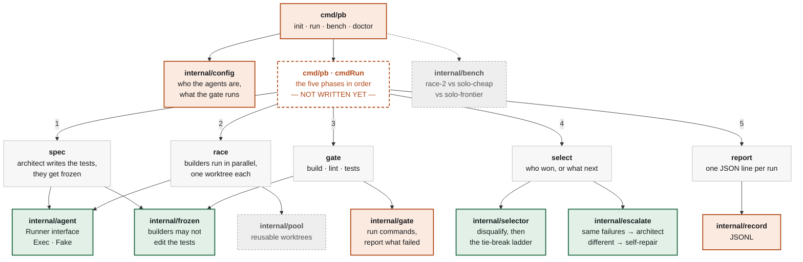

# parallel-builders

**One expensive agent writes the tests. Two cheap agents race to satisfy them. A compiler picks the winner.**

The usual way to use a coding agent is to ask an expensive model for a change and then read the diff. That puts you — the slowest component — in the loop on every change.

`pb` moves the expensive model to where it earns its cost, and takes you out of the middle.

```
pb run "add rate limiting to the public API routes"

  spec     architect wrote 7 tests · frozen at a1b2c3d     $0.014
  race     builder-a  worktree 1                           $0.048
           builder-b  worktree 2                           $0.052
  gate     builder-a  build ✓  lint ✓  tests 5/7   FAIL
           builder-b  build ✓  lint ✓  tests 7/7   PASS
  select   builder-b — only passing candidate
  ship     feat/rate-limit · 2 files, +34 −6
```

## How it works

**One expensive call, at the front.** The architect reads the task and writes a test suite — and nothing else. That suite is committed and **frozen**: it is the definition of "correct" for this change, and it is read-only from that point on.

**Cheap models race.** Two builders get the same task, the same frozen tests, and their own git worktree. Neither sees the other's work. Using two different model families matters — the value of racing comes from *independent* errors.

**A compiler decides.** Build, lint, and the frozen tests. No model is consulted, so selection is deterministic, free, and repeatable. When more than one candidate passes, a ladder of computable tie-breakers picks the winner: smallest diff, then fewest files, then fewest new dependencies.

**Nobody reads the losing diff.** Including you.

## Two rules that make it work

**Builders may not edit the tests.** Enforced as a check on the diff, not as an instruction in a prompt. A builder told "make the tests pass" will, given the chance, weaken an assertion — and a green run looks identical either way.

**Tests must fail before the change exists.** New tests are run against the previous commit; any that *pass* are testing nothing and get rejected. This is free, needs no model, and catches a bad specification before you have paid two builders to satisfy it.

## When they all fail

Comparing the two sets of failing test names costs nothing and decides what happens next:

| | |
|---|---|
| **Failed the same test, the same way** | Two independent attempts got stuck in the same place — the *specification* is the likely problem. Escalate. |
| **Failed different tests** | Two ordinary mistakes. Each builder gets its own diff and its own failures and returns a patch. No expensive call. |

Repair is not regeneration. "Try again" costs what the first round cost; handing back the diff and the specific failure produces a small patch instead. Same model, same round, a fraction of the bill.

Capped at two rounds, then it comes to you.

## Architecture

Every box below is a Go package. Colour is status, not category.



🟩 implemented and tested  🟧 partial  ⬜ stub  ⬛ not written

### The honest read of that picture

**The leaves are real. The trunk is not.**

Every `internal/` package currently imports *nothing* from this repo — they are independent, pure, and unit-testable, which is why three of them are already finished and covered. But it also means **nothing calls anything yet**. `cmdRun` is where they get assembled, and it is a list of TODOs.

That ordering was deliberate. The subtle parts are the leaves — what disqualifies a candidate, how you tell a spec problem from a coding mistake, which glob counts as a test file. Those are pure functions, so they can be got right in isolation and proven with tests. The wiring is mechanical by comparison, but it can't be written until `pool` and `gate` are real, because it has nothing to hold.

**Read it in this order** if you want to understand the tool: `selector` → `escalate` → `frozen`. Roughly 400 lines, no dependencies, and between them they contain every decision the system makes.

## Status

Early. The design is settled; most of the implementation is not.

| | |
|---|---|
| `internal/frozen` | ✅ the test-file guard |
| `internal/selector` | ✅ disqualifiers and the tie-break ladder |
| `internal/escalate` | ✅ the failure-set comparison |
| `internal/agent` | ✅ runner interface, exec and fake |
| `internal/gate`, `record`, `config` | 🚧 partial |
| `internal/pool`, `bench` | ⛔ stubs |

## Building

```sh
go build ./cmd/pb
go test ./...
```

No dependencies yet, on purpose.

## Licence

MIT
